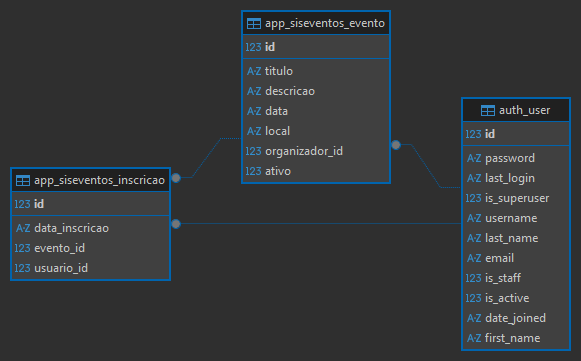

# SisEventos

Sistema web para gerenciamento de eventos, desenvolvido com Django.

## 📌 Descrição
O SisEventos permite que usuários realizem cadastro e login para se inscrever em eventos disponíveis.  
Administradores podem cadastrar, editar, encerrar eventos e visualizar os inscritos.

Projeto desenvolvido para fins **acadêmicos** e **estudo**, com foco em backend utilizando Django.

---

## ⚙️ Funcionalidades

### Usuário
- Cadastro de usuário
- Login e logout
- Visualização de eventos disponíveis
- Inscrição em eventos
- Cancelamento de inscrição
- Visualização dos eventos em que está inscrito

### Administrador
- Cadastro de eventos
- Edição de eventos
- Exclusão de eventos
- Visualização dos inscritos por evento
- Encerramento de eventos

---

## 🛠️ Tecnologias Utilizadas
- Python 3
- Django
- Bootstrap (templates HTML)
- SQLite (ambiente de desenvolvimento)

---

## ▶️ Como executar o projeto

1. Clone o repositório:
```bash
git clone https://github.com/seu-usuario/siseventos.git

2. Crie e ative um ambiente virtual:
python -m venv venv
venv\Scripts\activate

3. Instale as dependências:
pip install django

4. Execute as migrações:
python manage.py migrate

5. Inicie o servidor:
python manage.py runserver

6. Acesse no navegador:
http://127.0.0.1:8000/


## 🔐 Observações

- O banco de dados (db.sqlite3) não está versionado.
- O projeto utiliza autenticação padrão do Django.
- Interface construída com templates Django e Bootstrap

(assets/DER_sistema_de_eventos.png)

```
## DER do Sistema de Eventos
